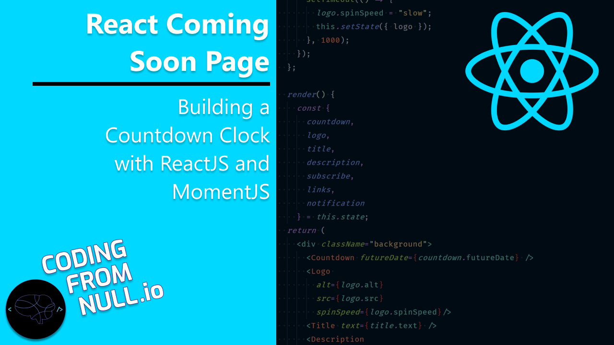

Today you will learn how to build your own countdown clock using ReactJS and MomentJS. MomentJS is a fantastic library for dealing with dates and times in JavaScript. You will build the clock as a ReactJS component, making it extremely reusable. When the component is passed some future date, it will make all the necessary calculations to render a countdown clock that will tick down until that moment in time. Finally, you will style the clock using some CSS Grid tricks to make it look like an actual clock. This clock is a great feature for the Coming Soon page that you are building, but it has many other use cases as well. For instance, a countdown to an event or a countdown until the end of a sale are also perfect use cases for this component. So, go ahead, [watch the video](https://www.youtube.com/watch?v=03WFsg-6FK0), and put it to work in your application today.

