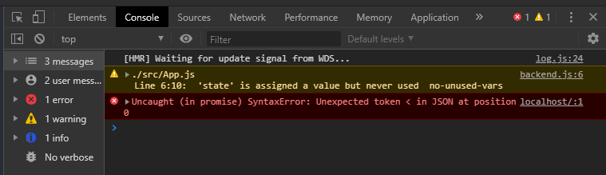
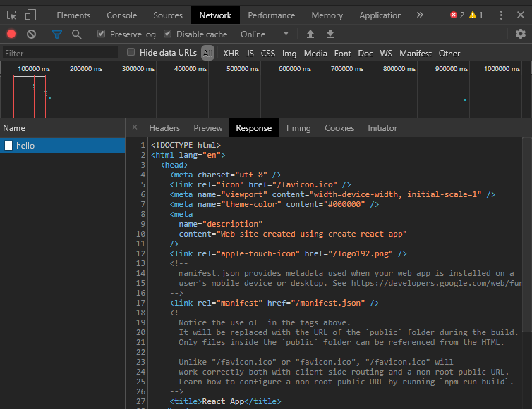

Netlify Functions are a great way to house all the code needed for your app in one repository. Gone are the days of having to spin up and maintain your own server just to handle some simple form submissions on your site. The tricky part with Netlify Functions, and serverless functions in general, is testing them locally. In this post, you will learn how to do just that with a tool called `netlify-lambda`. So, let's get started.

In order to get started, there are a few things that you will need to install. First, you must install the Netlify CLI globally with the command `npm install netlify-cli -g`. Next, we will be working with a fresh install of `create-react-app`. To get this up and running, type the following two commands in your terminal:

```terminal
npx create-react-app netlify-functions-example
cd netlify-functions-example
```

These commands will create a fresh install of `create-react-app` named `netlify-functions-example` and then open the app directory. If you are new to `creat-react-app` you can check out a blog post I wrote as an introduction to the tool. Now that you are in the app's directory, install all of the dev dependencies that you need with the command `npm install -D netlify-lambda npm-run-all`. This will install `netlify-lambda` to run the development server for your functions and `npm-run-all` which will allow you to run multiple scripts in parallel.

Now that`netlify-lambda` is installed, you have accesss to two powerful scripts that will help you test your functions locally. These scripts are `netlify-lambda build` and `netlify-lambda serve`. Let's edit the scripts in your `package.json` file so that we can begin using them. Edit your scripts so that they look like the following:

```json
"scripts": {
    "start": "react-scripts start",
    "start:lambda": "netlify-lambda serve src/functions",
    "build": "run-p build:**",
    "build:app": "react-scripts build",
    "build:lambda": "netlify-lambda build src/functions",
    "test": "react-scripts test",
    "eject": "react-scripts eject"
}
```

Notice, that you are telling `netlify-lambda` to build and serve your functions from the `src/functions` directory. This is where your functions will live for your local development environment. When you call the `netlify-lambda serve` script, it will build your functions and start a development server with access to these built functions. However, we have not specified where these built functions will go. Don't worry, we will. First, let's talk about that `build` script. In this script, we are using the `npm-run-all` tool to build both the react application and the functions (used for deployemnt on Netlify). Now, let's specify where our functions should be built. Create the following `netlify.toml` file in the root directory of your project:

```toml
[build]
    command = "npm run build"
    functions = "built-functions"
```

This file will tell `netlify-lambda` that our build command is `npm run build`. Remember configuring this script earlier? The file also tells it to put our built functions into a folder called `built-functions` in our projects root directory. Note: I could have named this folder anything and chose to name it `built-functions` here only for clarity. Now, let's write our first function. Create the `src/functions` directory and then create a file within that directory called `hello.js`. In `hello.js` write the following function:

```javascript
exports.handler = async (event, context, callback) => {
  return {
    statusCode: 200,
    body: JSON.stringify({ msg: `Hello, World!` }),
  }
}
```

All Netlify Functions will start with `exports.handler` and take the same three arguments of event, context, and callback. In this example we will be using the async await syntax over using callbacks. Now that you have written your first function, I am sure you are curious to see how you can call it. In the `App.js` file, go ahead and make the following changes so that you have a form to submit from your application. Notice that we are using fetch to call `/.netlify/functions/hello`. This is because when you go to production your Netlify Functions will be available at `<your-website>/.netlify/functions/<function-name>`.

```jsx
import React, { useState } from "react"
import logo from "./logo.svg"
import "./App.css"

function App() {
  const [state, setState] = useState({
    email: "",
  })

  const handleChange = e => {
    setState({ email: e.target.value.trim() })
  }

  const handleSubmit = e => {
    e.preventDefault()
    fetch(`/.netlify/functions/hello`)
      .then(res => res.json())
      .then(json => console.log(json))
  }

  return (
    <div className="App">
      <header className="App-header">
        
        <form onSubmit={handleSubmit}>
          <input type="email" onChange={handleChange} />
          <button type="submit">Submit</button>
        </form>
      </header>
    </div>
  )
}

export default App
```

In your terminal run the command `npm run start:lambda`. This is the command we configured earlier that will start the develoment server for our functions. Notice in the output that it has built our `hello` function and is now listening for requests on port 9000. Also, notice that in your root directory you now have a folder called `built-functions` with the minified version of your `hello` function inside. Open up another terminal and type in the command `npm start` to start your react application. In your browser type `Ctrl+shift+i` to bring up the developer tools and click on the tab titled `Console`. Now type in an email address into the input box and hit submit. You should see the following error in the console:



When you see this type of error, it usually means that instead of JSON, you are getting back either XML or HTML (signified by the '<' in the error). Now, click on the `Network` tab and click on the `hello` request that was made and view the response. You should see the following:



So why is our request just sending us back the html of our application? This is because our functions server is running on port 9000. However, we are calling fetch with `/.netlify/functions/hello` from within our react app which is running on port 3000. Now, in production our app and our functions will be running on the same domain so this won't be a problem. But, how do we test this locally? In your browser, type in `http://localhost:9000/hello`, and you will quickly see that our function is working and sending back our 'Hello, World!' JSON object. This is great, but I want to test my function from within my app. No problem, we just need to proxy the request. Go back to your `package.json` file and add the following to proxy the request to port 9000:

```json
"proxy": "http://localhost:9000"
```

Now restart both of your development servers, and resubmit the form with the developer tools open to the `Console` tab. You should now see your 'Hello, World!' JSON object coming through. Congratulations, you can now test your functions locally before deploying them to Netlify. Check out the code on GitHub, with a slightly more complex serverless function. I hope this post has helped you understand how to integrate these functions into your app a little better. Help keep content like this coming by quickly sharing on your favorite social media platform below. And don't forget to leave a comment to help improve the post.
